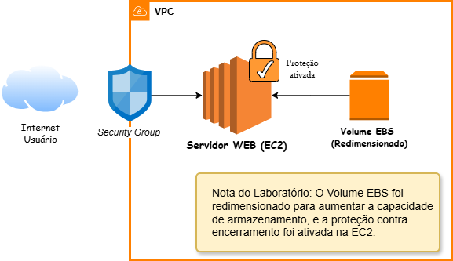

# Projeto 01 - Introdução ao Amazon EC2 

#### OBJETIVO
Implantar um servidor web em uma instância Amazon EC2, configurando regras de segurança, automatizando a instalação do Apache via User Data e explorando o redimensionamento de recursos da instância e do volume EBS.

#### SERVIÇOS UTILIZADOS
Amazon EC2
Security Group
Amazon EBS

#### IMPLEMENTAÇÃO
1. Criação de uma instância **Amazon EC2** na AWS.
2. Seleção da **Amazon Machine Image (AMI)**
3. Escolha do **tipo de instância apropriado** para testes
4. Configuração do **Security Group**, permitindo acesso _HTTP e HTTPS_ para acesso ao servidor web.
5. Ativação da opção **Proteção contra término** para evitar exclusão acidental da instância.
6. Inserção de um **script Bash** no campo User Data para automatizar a instalação e inicialização do servidor _web Apache_ durante o boot da instância.
7. Redimensionar a instância: **Tipo de instância e volume EBS**
8. **Inicialização da instância** e verificação do funcionamento do servidor acessando o IP público da EC2 pelo navegador.

#### EVIDÊNCIA


#### ARQUITETURA


#### SCRIPT
```bash
#!/bin/bash
yum -y install httpd
systemctl enable httpd
systemctl start httpd
echo '<html><h1>Hello From Your Web Server!</h1></html>' > /var/www/html/index.html
```

#### APRENDIZADO
_Este laboratório permitiu compreender o processo de criação e configuração de uma instância EC2, além da utilização do campo User Data para automatizar a instalação de serviços durante a inicialização da máquina. Também reforçou o papel dos Security Groups no controle de acesso ao servidor e a importância do Amazon EBS como armazenamento persistente da instância_
