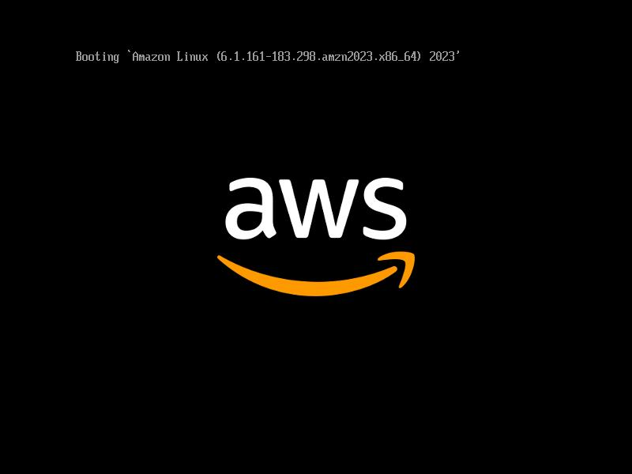

# Projeto 01 - Introdução ao Amazon EC2 

#### OBJETIVO
Implantar um servidor web em uma instância Amazon EC2, configurando regras de segurança, automatizando a instalação do Apache via User Data e explorando o redimensionamento de recursos da instância e do volume EBS.

#### SERVIÇOS UTILIZADOS
* Amazon EC2
* Security Group
* Amazon EBS
* Apache HTTP Server

#### IMPLEMENTAÇÃO
1. Criação de uma instância **Amazon EC2** na AWS.
2. Seleção da **Amazon Machine Image (AMI)**
3. Escolha do **tipo de instância apropriado** para testes
4. Configuração do **Security Group**, permitindo acesso _HTTP e HTTPS_ para acesso ao servidor web.
5. Ativação da opção **Proteção contra término** para evitar exclusão acidental da instância.
6. Inserção de um **script Bash** no campo User Data para automatizar a instalação e inicialização do servidor _web Apache_ durante o boot da instância.
7. Redimensionar a instância: **Tipo de instância e volume EBS**
8. **Inicialização da instância**
8. Implantação de um servidor web utilizando **Apache HTTP Server** através de script no User Data da instância.

#### ARQUITETURA DA SOLUÇÃO
_A solução consiste na implantação de um servidor web em uma instância do Amazon EC2 utilizando Amazon Linux.
Durante a inicialização da instância, foi utilizado o recurso User Data para executar automaticamente um script de configuração que instala e inicia o Apache HTTP Server.
O acesso ao servidor é controlado por um Security Group, permitindo tráfego HTTP e HTTPS para que a aplicação web possa ser acessada externamente pelo navegador.
O armazenamento da instância é realizado através de um volume do Amazon EBS, garantindo persistência dos dados mesmo após reinicializações da máquina.
Essa arquitetura permite disponibilizar uma aplicação web simples acessível pela internet utilizando uma instância EC2._


#### EVIDÊNCIA



#### SCRIPT
```bash
#!/bin/bash
yum -y install httpd
systemctl enable httpd
systemctl start httpd
echo '<html><h1>Hello From Your Web Server!</h1></html>' > /var/www/html/index.html
```

#### APRENDIZADO
_Este laboratório permitiu compreender o processo de criação e configuração de uma instância EC2, além da utilização do campo User Data para automatizar a instalação de serviços durante a inicialização da máquina. Também reforçou o papel dos Security Groups no controle de acesso ao servidor e a importância do Amazon EBS como armazenamento persistente da instância_
