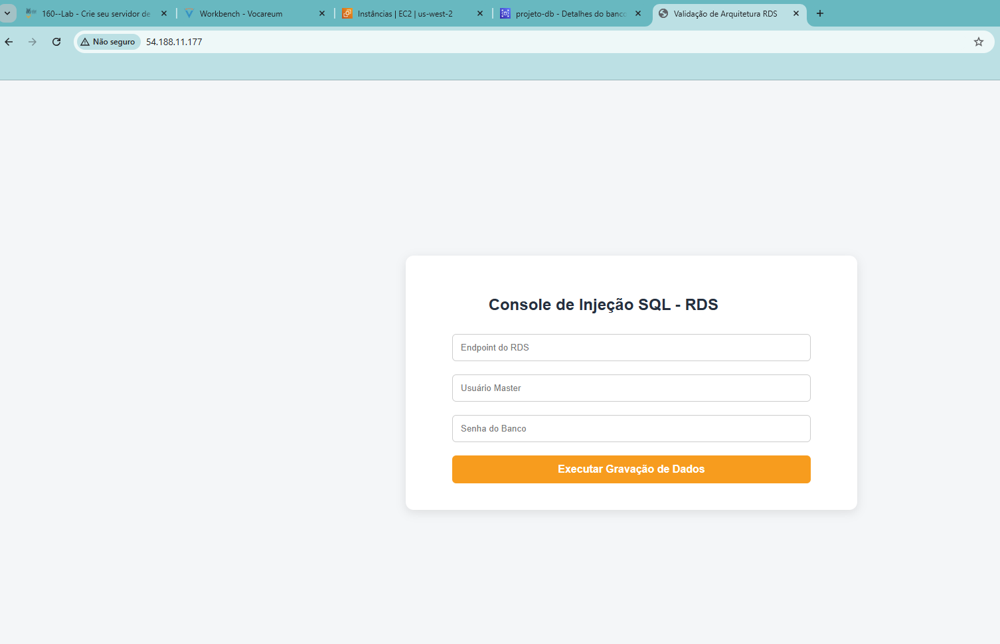
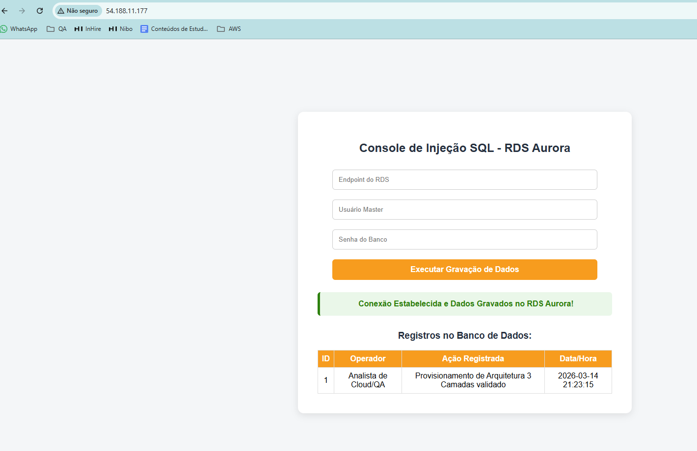
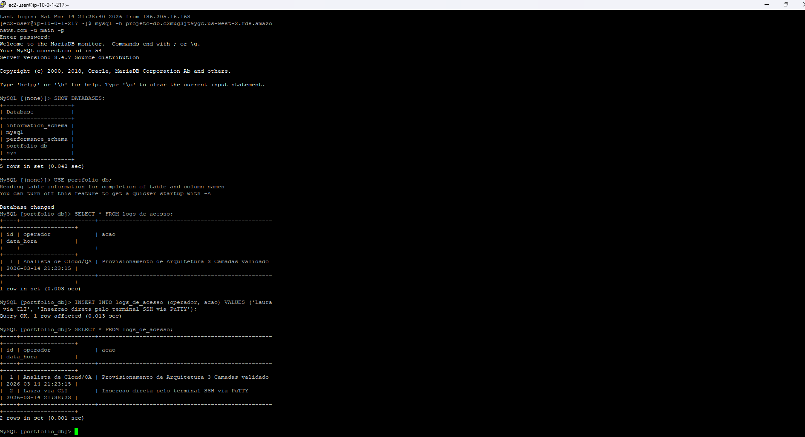
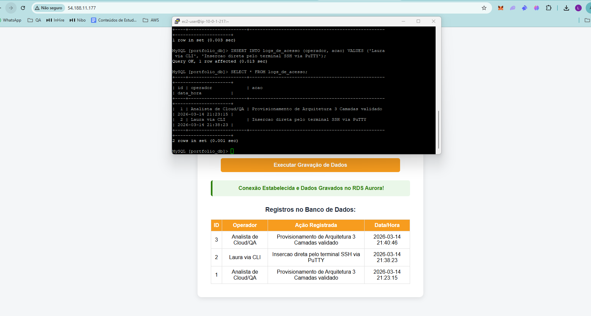
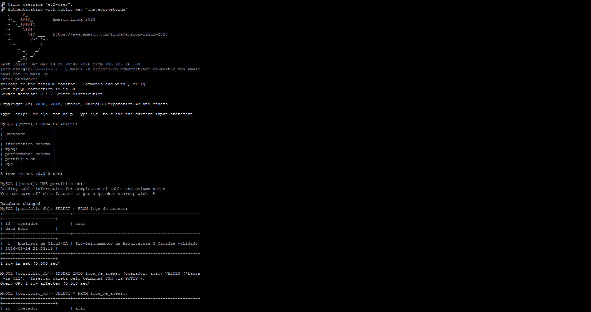

# Implementação de Banco de Dados MySQL com Amazon RDS e EC2

#### OBJETIVO
Implementar uma arquitetura de banco de dados na AWS utilizando rede personalizada, instância EC2 e banco gerenciado.
O projeto demonstra a comunicação entre uma aplicação web hospedada em uma instância do Amazon EC2 e um banco de dados hospedado no Amazon RDS utilizando Amazon Aurora.
Também foi realizado o registro de acessos ao banco através de aplicação web e terminal CLI para validação da arquitetura.

#### SERVIÇOS UTILIZADOS
* Amazon VPC
* Amazon EC2
* Amazon RDS
* MySQL
* Internet Gateway
* Security Groups
* Apache Web Server
* PHP
* MySQL CLI


#### IMPLEMENTAÇÃO
1. Criação da VPC
Foi criada uma VPC para isolamento da infraestrutura.
CIDR utilizado

```bash
10.0.0.0/16
```

2. Criação das Subredes
Foram criadas três subredes.
| CIDR        | Tipo   |
|10.0.0.0/24 | Pública |
|10.0.1.0/24 | Privada |
|10.0.3.0/24 | Privada |

_As subredes privadas foram criadas em zonas de disponibilidade diferentes para permitir maior disponibilidade do banco de dados._

3. Internet Gateway
Foi criado um Internet Gateway e associado à VPC.

_Essa configuração permite que recursos da subrede pública se comuniquem com a internet._

4. Tabela de Rotas Pública
Foi criada uma tabela de rotas chamada
```bash
rt-publica
```
Foi adicionada a rota
```bash
0.0.0.0/0 → Internet Gateway
```

_Essa rota permite que qualquer tráfego externo seja direcionado para a internet._

A subrede pública foi associada a essa tabela de rotas.
Também foi ativada a atribuição automática de IP público.

5. Security Groups
Foram criados dois grupos de segurança

**Security Group da EC2**
Regras de Entrada
| Porta | Protocolo |
| ----- | --------- |
| 22    | SSH       |
| 80    | HTTP      |

**Security Group do RDS**
| Porta | Origem                |
| ----- | --------------------- |
| 3306  | Security Group da EC2 |

_Essa configuração permite que apenas a instância EC2 acesse o banco._

6. Criação da Instância EC2
Foi criada uma instância do Amazon EC2 na subrede pública.

Configurações realizadas:
* instalação do Apache
* instalação do PHP
* criação de uma aplicação web para conexão com banco de dados
  
_A aplicação permite registrar logs de acesso no banco._

7. Criação do Database Subnet Group
Foi criado um grupo de subredes para o banco de dados.
```bash
projeto-db-subnet-group
```
_Foram utilizadas as duas subredes privadas._

8. Criação do Banco de Dados
Foi criado um banco de dados no Amazon RDS utilizando a engine MySQL.

_Após a criação foi copiado o endpoint para uso na aplicação web._

9. Teste da Aplicação Web
A aplicação permite inserir registros contendo:
* operador
* ação
* data e hora
Os dados são armazenados na tabela
```bash
logs_de_acesso
```

10. Conexão via Terminal SSH
A instância EC2 foi acessada via SSH utilizando PuTTY.
Após o acesso foi realizada conexão com o banco.

## EVIDÊNCIAS DE FUNCIONAMENTO
### Banco de dados inicialmente sem registros**


### Registro criado via aplicação web (Console)


### Inserção direta via CLI utilizando SSH na EC2


### Validação final com três registros no banco


### Acesso via terminal e conexão com o RDS


#### COMANDOS UTILIZADOS
```bash
Conexão com banco
mysql -h ENDPOINT_RDS -u USUARIO -p

Listar bancos
SHOW DATABASES;

Selecionar banco
USE portfolio_db;

Consultar registros
SELECT * FROM logs_de_acesso;

Inserir registro via CLI
INSERT INTO logs_de_acesso (operador, acao)
VALUES ('Laura via CLI', 'Insercao direta pelo terminal SSH via PuTTY');

Validação final
SELECT * FROM logs_de_acesso;
```

**APRENDIZADO**

Durante este projeto foram praticados conceitos importantes de arquitetura em nuvem:

* criação de rede isolada utilizando VPC
* segmentação entre subrede pública e privada
* configuração de rotas e Internet Gateway
* controle de acesso utilizando Security Groups
* implementação de banco gerenciado com RDS MySQL
* conexão entre aplicação hospedada em EC2 e banco de dados
* manipulação de dados via aplicação web e via CLI

_O laboratório permitiu validar na prática o funcionamento de uma arquitetura simples de aplicação conectada a banco de dados na AWS._
